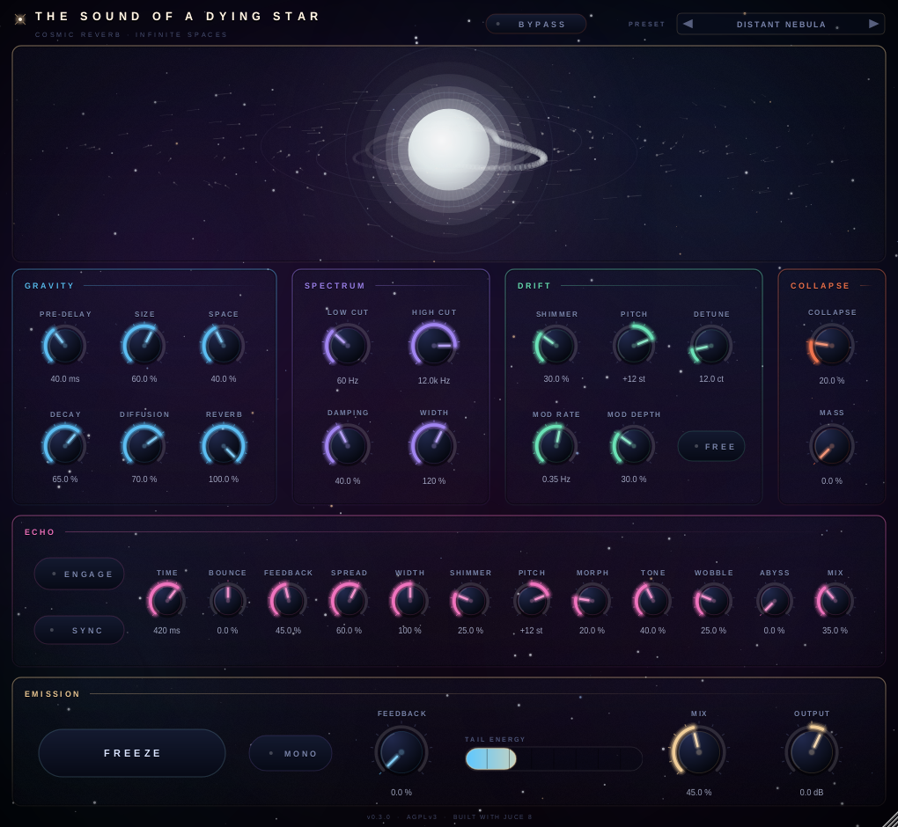
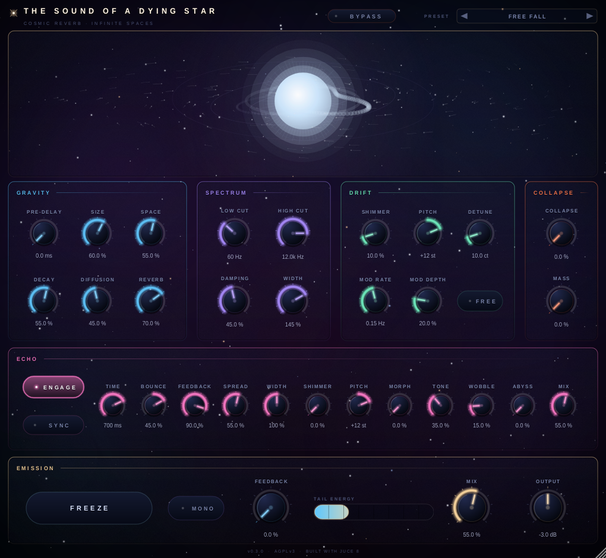

# The Sound of a Dying Star


A cosmic shimmer reverb for ambient work, with a delay in front of it that is built the
same way. Feedback delay network, pitch-shifted feedback paths and a soft clipper inside
every loop — so the same instrument covers a barely-there halo over a pad and the
sub-heavy roar of something collapsing.

VST3 and standalone, Windows and Linux.



## What it does

The core is an 8-line feedback delay network with a Hadamard mixing matrix. Three things
are wrapped around it, and between them they are the reverb:

- **A shimmer path.** The network's output is pitch-shifted and fed back in, so the tail
  climbs an octave (or whatever interval you set) each time round. Two voices, detuned
  against each other, so it widens into a chorus of itself rather than transposing.
- **A sub-octave "mass" path.** The same trick an octave down, low-passed to rumble.
  Wind it up and the tail acquires a bottom end that was never in the source.
- **A soft clipper inside the loop.** Linear below its threshold, so at low **Collapse**
  it colours nothing and simply guarantees that no combination of controls can run away.
  Driven hard, it *is* the collapse — the tail compresses, distorts and turns into a roar.

In front of all of it sits a stereo delay built out of the same parts — [its own section
below](#the-echo).

**Decay** runs from a quarter of a second to sixty; past 99 % it stops decaying at all.
**Freeze** opens the loop filters and holds what is in the network — measured at less
than 1.5 dB of loss over twenty seconds.

**Feedback** is the one to reach for if you want to leave it running. It pulls the loop
gain away from the decay curve and up past unity, so the network regenerates rather than
fades — and unlike Freeze it keeps the input open, so new material lands on top of what
is already circulating. Feed it almost anything and it grows into a full wash and stays
there. One 40 ms plucked note, at maximum feedback, measured second by second:

| after | 1 s | 10 s | 30 s | 60 s | 180 s | 300 s |
|---|---|---|---|---|---|---|
| level | −26.9 | −17.6 | −7.4 | −8.3 | −8.2 | −8.0 dBFS |

It blooms over the first half minute and then simply stays there.

What keeps that safe is the soft clipper inside the loop, which bounds every line
unconditionally. The governor on top of it is not a safety net and not a leveller — it is
a ceiling. Below the ceiling it does nothing at all and feedback means feedback; above it,
a fractional exponent asks for a gentle trim rather than a proportional one, so a loud
passage makes the network ease back and swell again over several seconds instead of
leaving a hole. Its floor is deliberately high: a governor that can pull the loop gain a
long way down is a governor that can cut a tail short, which is the opposite of the point.

At 0 % the control is inert and the decay behaviour is untouched, which is what keeps
sessions saved before it existed sounding the same.

Zero latency. No oversampling, no lookahead, so bypass is a straight pass-through and the
dry path is bit-identical at 0 % mix.

## The echo

The **Echo** section is a stereo delay sitting in front of the network, inside the wet
path — so Mix still means what it says and the dry signal never goes near it. Its output
goes two ways at once: straight to the output, where it stays a repeat you can count, and
through the diffusers into the reverb, where it blooms.

The feedback path is the part that matters. A repeat is darkened, transposed up by a
shimmer voice, dragged down by a second one, wobbled by two slow modulators and run
through the same soft clipper the reverb uses — so nothing ever comes back the way it
left, and the line can run at unity, or a little past it, without ever settling into a
loop of the same sound.

| Control | What it does |
|---|---|
| **Sync** | Takes the spacing from the host's tempo instead of the Time knob. |
| **Time** | 2 ms to 2 s, or a note value while Sync is on. Changes glide, so sweeping it warps like tape. |
| **Bounce** | Right: each repeat lands sooner than the last. Left: they spread apart. |
| **Feedback** | Past unity at the top, where the repeats stop ending. |
| **Spread** | An orthogonal rotation between the channels: at 0 % a stereo dual delay, at 100 % the repeats bounce left, right, left. |
| **Width** | The repeats' own image on top of that — mono in the middle at 0 %, wider than hard-panned at 200 %. |
| **Shimmer** · **Pitch** | How much of each pass comes back transposed, and by how far. |
| **Morph** | How far the pitch voices wander off that interval, and keep wandering. |
| **Tone** | How fast the repeats go dark. |
| **Wobble** | Movement on the read heads, scaled with the delay time. |
| **Abyss** | Downward drag plus drive. The delicate-to-black-hole control. |
| **Mix** | How present the whole section is, direct and through the reverb both. |

**Time** goes down to 2 ms, which is not an echo at all — down there the line is a comb
filter and **Feedback** is its resonance. That end of the range only works because
everything cumulative in the loop is scaled by the spacing: at 25 ms a pass happens forty
times a second, so a per-pass darkening, drag or governor trim that is gentle on a
half-second repeat would be thirty dB a second on a short one. Scale it and the same
feedback setting holds both. Measured: after ten seconds of ringing, a 25 ms setting sits
at −26.8 dBFS and a 600 ms setting at −26.4.

**Sync** puts the same knob on the grid. The Time control becomes a note value —
eighteen of them, from a 1/32 triplet to a dotted whole note, ordered by length so the
knob still runs from the shortest repeat to the longest — and the spacing is taken from
whatever tempo the host reports, block by block, so a tempo map moves the delay with it.
Measured with one click in: 500.0 ms for a 1/4 at 120 BPM, 250.0 for a 1/8, 1000.0 for a
dotted 1/4 at 90.

Note values longer than the lines can hold are folded rather than clipped: a whole note
at 60 BPM is four seconds and the lines hold two, so it comes back as two seconds — half
the note, still on the grid, where a delay clipped to two seconds of a four-second note
is simply late. Hosts that report no tempo, and the standalone, which has no transport at
all, run at 120 BPM.

**Bounce** is a dropped thing. Each repeat takes a fixed percentage off the gap before
the next one, so the spacing runs down geometrically and one strike turns into
*pim… pim… pim, pim pim pimpimpim*. An onset restarts it, so the next thing played drops
from the top again rather than arriving into a rattle.

It is stepped between repeats and crossfaded between two fixed read heads, never swept.
Sweeping a recirculating delay line is a pitch shift, and a pitch shift inside a feedback
loop compounds once per pass — a fraction of a semitone becomes four octaves in a few
seconds, which is a siren, not a ball. Stepped, the note stays exactly where it was:
measured four seconds and two dozen bounces in, the source pitch is still 33 dB above
anything around it. The steps land in the middle of the gaps rather than on the repeats,
because on the repeat a step that goes the other way lands just behind one and plays it
twice.

Measured, one click into a 400 ms delay at Bounce 70 %: gaps of 353, 312, 275, 242, 214,
189 ms. At −70 % the same click gives 447, 500, 558, 624, 698, 779.

A run-down takes about one gap divided by the contraction, so the control has to cover a
two-second spacing as well as a fifty-millisecond one. At the top of it, two seconds runs
down to a rattle in eight; at 45 % — where *Free Fall* sits — seven hundred milliseconds
takes about fifteen seconds to get there and another two to die out.

**Spread** is the ping-pong. At 100 % a mono source alternates hard left and hard right,
measured as a balance of +1.00, −1.00, +1.00, −1.00 across the first four repeats; at 0 %
it stays where it was. The rotation is tapered, because a straight angle put all of the
bounce in the last part of the travel — at 60 % the second repeat used to sit dead centre,
and now it is two thirds of the way to the right.

**Width** is the delay's own image, independent of the Width in Emission. At 0 % the
repeats collapse to the middle of a reverb that is still as wide as it was; at 200 % they
are wider than hard-panned. Between them the two controls cover most of what anyone means
by wanting a delay to do something in the stereo field.

**Morph** is what stops a long-running delay turning into a chord. Four slow modulators
that share no factors move the two pitch voices around, up to a fifth either way, so a
repeat is transposed by whatever the shimmer voice happened to be doing when it passed
through — and the next one by something else. Wound up with **Shimmer**, the repeats
glide between intervals instead of stacking on one. It is the setting the *Photon Sphere*
preset is built on: 18 ms, feedback near the top, and the resonance sliding.

**Abyss** is the one to reach for when a delay is not supposed to be tidy. Wind it up and
every pass lands flatter than the last — a little over two and a half semitones at the
top — darker, and harder into the clipper, until what comes back is a downward spiral
rather than an echo. `devtool check` measures the fall: feed it one tone, and ten passes
later there is several hundred times more energy well below that tone than the same run
with the control at zero.

The section is off by default and, while it is off, provably inert — bit-identical to a
build without it — so nothing saved before it existed changed.



## The room

A feedback delay network builds a beautiful diffuse wash, but it arrives as a wash — it
has no beginning. A real hall hands you a handful of discrete reflections off the near
walls first, and the ear reads the pattern of those as the size of the room and your
distance from the far end of it. Take them away and every space sounds like the inside of
a cloud, which is what people mean when they say a reverb is flat.

**Space** is that early field: nine taps per channel, no two the same and the two sets
sharing no ratios, each one a little quieter and duller than the last, then a pair of
all-passes so they read as reflections rather than as nine copies of the source. The taps
move out with **Size**, so the room and the tail agree on how big the place is. It goes
to the output and, at half the level, into the network — the tail then grows out of the
reflection pattern instead of fading up out of nothing.

It is a room and not a level: `devtool check` measures 5 dB more energy in the first
140 ms with Space at 80 %, and the tail a second and a half later within half a dB of
where it was.

**Reverb** is the network's own dry/wet, sitting next to it. The **Mix** control in
Emission is still the balance against the dry signal; this one is the balance between the
space and the delay inside the wet path. At 0 % the reverb disappears and the Echo
section is all that is left, which is how to use this as a delay with a reverb attached
rather than the other way round.

Space is the one control in the plug-in whose default is not its inert position — a new
instance opens with a room, because that is the point. A session saved before the early
field existed is migrated to 0 % explicitly when it loads, so it reloads sounding exactly
as it was saved.

### The controls

| Group | Controls |
|---|---|
| **Gravity** | Pre-Delay · Size · Space · Decay · Diffusion · Reverb |
| **Spectrum** | Low Cut · High Cut · Damping · Width |
| **Drift** | Shimmer · Pitch · Free · Detune · Mod Rate · Mod Depth |
| **Collapse** | Collapse · Mass |
| **Echo** | Engage · Sync · Time · Bounce · Feedback · Spread · Width · Shimmer · Pitch · Morph · Tone · Wobble · Abyss · Mix |
| **Emission** | Freeze · Mono · Feedback · Mix · Output |
| **Chrome** | Bypass, next to the preset name |

**Mono** collapses everything leaving the plug-in — dry included, because the question it
answers is what the far end of the chain will hear. It is a crossfade rather than a
switch, and at zero it is arithmetically absent: both channels come out bit-identical to
what they were. **Bypass** is the same parameter the host's own bypass drives, so the two
always agree; it hands the input straight back, and the tail meter drops to nothing
rather than sitting where it was when you pressed it.

**Size** is mapped logarithmically and runs a long way past room-sized: at the top the
eight lines are over half a second each. That is long enough that the network stops
behaving like a reverb and starts behaving like a multi-tap delay — the Echo section is
for repeats you want to place, the Size control is for the ones you want to lose. Size
high, **Diffusion** low and **Feedback** up is the one-note-and-walk-away setting; the
*Light Echo* preset is exactly that.

**Free** takes the shimmer's **Pitch** off the semitone grid. Off — which is how it
ships, and how every preset is saved — the interval snaps to whole semitones, because
that is what a shimmer is for. On, the knob runs continuously across the same two
octaves, and +7.35 st is exactly what it says: measured with a 500 Hz tone in, the
transposed voice sits at 1017.5 Hz rather than on the octave the snapped control would
have rounded it to. It is the same parameter either way, so a value set off the grid
survives being snapped back on — the panel and the engine round it identically.

**Detune** does double duty: it spreads the two shimmer voices apart in cents, and it
sets the depth of a very slow independent drift on each delay line. That second half is
what stops a long tail sounding like a static chord.

Fifteen factory presets span the range, from *Whisper of Light* to *Black Hole Roar*,
and they are exposed as host programs as well as through the panel. *Heat Death* and
*Light Echo* are the two meant to be started and left alone. The last five are built
around the delay: *Slow Light* at the gentle end, *Redshift* for repeats that never stop,
*Photon Sphere* for an 18 ms line resonating with the pitch sliding around, *Free Fall*
for one strike bouncing itself to a standstill over about fifteen seconds, and
*Singularity* with the Abyss almost at maximum.

The star in the middle is driven by the controls and by the signal: its colour is the
loop's temperature, the accretion disk grows with **Mass**, the disk stops turning when
you **Freeze**, and past a certain amount of collapse an event horizon opens in the
middle of it.

## Building

Needs CMake 3.22+, a C++17 compiler and git. On Linux and macOS there is a script that
does the whole thing — configure, build, run the offline checks — and can start what it
built:

```bash
./build.sh --run
```

It only reconfigures when something it depends on has changed, so an ordinary
edit-and-rebuild is a couple of seconds plus the time the checks take. `--release` adds
link-time optimisation and stamps the commit into the panel, for a binary you are going
to hand to someone; `--shot` re-renders `docs/panel.png`; `--icon` redraws the two PNGs in
`assets/`; `--clean` starts over; `--no-check`, `--no-install` and `--debug` do what they
say. `./build.sh --help` lists them.

The application icon is drawn, not authored: `Source/gui/Icon.cpp` paints a collapsing
star inside its accretion disk out of the same palette as the panel, and every dimension
in it is a fraction of the square it is given, so each size a platform asks for is
rendered at that size instead of being scaled down from one master. The two PNGs are
committed because CMake hands them to JUCE at configure time — before anything that could
draw them has been built — so `--icon` is only needed when the drawing changes.

By hand, or on Windows:

```bash
git clone --recurse-submodules --shallow-submodules https://github.com/doctorspider42/the-sound-of-a-dying-star.git
cd the-sound-of-a-dying-star
cmake -B build -DCMAKE_BUILD_TYPE=Release
cmake --build build --parallel
```

If you already cloned without submodules, `git submodule update --init --recursive`.

Linux also needs:

```bash
sudo apt-get install -y build-essential cmake ninja-build libasound2-dev libfreetype-dev libfontconfig1-dev libx11-dev libxext-dev libxrandr-dev libxinerama-dev libxcursor-dev libxcomposite-dev libxrender-dev libgl1-mesa-dev fonts-dejavu-core
```

Windows needs Visual Studio 2022 with the Desktop C++ workload.

`DYINGSTAR_COPY_AFTER_BUILD` is `ON` by default and installs the built VST3 into your
user plug-in folder. Turn it off for CI or packaging builds.

`DYINGSTAR_LTO` is `OFF` by default and `ON` for the release builds CI publishes. It buys
a few per cent of CPU in the finished binary and costs minutes on every link — the
plug-in, the standalone and the tool each re-optimise the whole of JUCE — so with it on,
changing one line of DSP is a five-minute rebuild instead of a ten-second one. Leave it
off while working on the code:

```bash
cmake --build build --parallel      # ~10 s after a one-file change
```

## Verifying it without a DAW

`DYINGSTAR_BUILD_TOOLS=ON` builds a console tool that needs neither an audio device nor
a display, and all of its modes run in CI:

```bash
cmake -B build -DCMAKE_BUILD_TYPE=Release -DDYINGSTAR_BUILD_TOOLS=ON -DDYINGSTAR_COPY_AFTER_BUILD=OFF
cmake --build build --parallel
./build/DyingStarDevTool_artefacts/Release/DyingStarDevTool check
./build/DyingStarDevTool_artefacts/Release/DyingStarDevTool shot panel.png
./build/DyingStarDevTool_artefacts/Release/DyingStarDevTool icon icon.png 1024
```

`check` asserts, among other things, that the dry path is untouched at 0 % mix, that the
wet path is level-matched to the dry, that the decay control changes the decay, that
shimmer really puts energy an octave above the source, that the delay puts its repeat
where the time control says, that freeze holds for twenty seconds, that nothing goes
non-finite with every control at maximum, and that all of it survives 44.1–192 kHz at
block sizes from 16 to 2048. It prints the CPU cost as a number, with and without the
delay engaged, so a regression is visible rather than merely suspected.

`shot` renders the editor to a PNG with no window and no display server, which is how the
screenshots in this README are made and how a panel that fails to paint fails the build.
`icon` draws the application mark at any size you ask for, which is where the PNGs in
`assets/` come from.

## Licence

The code in `Source/` and `tools/` is **GPLv3-or-later**, copyright © 2026 doctorspider42.

It links against **JUCE 8 under the AGPLv3**, so any binary distributed from this project
is a combined work that additionally carries AGPLv3 section 13 — the clause about
offering source to users who interact with the program over a network. A plug-in running
in a DAW on someone's desktop does not do that, so in practice the clause is inert, but
it is not optional and anyone redistributing a build is entitled to know it applies.

Both texts are in the repository and in every release archive: `LICENSE` (GPLv3) and
`LICENSE.AGPLv3`. Third-party components are listed in [NOTICE.md](NOTICE.md).

Giving the binaries away is fine. What copyleft requires is *corresponding source*: JUCE
is pinned as a submodule and every release archive carries a `BUILD-INFO.txt` naming this
repository's commit and the exact JUCE revision, so "here is the source that built this"
is a link rather than an investigation.

## Downloads

Every push to `main` that passes the checks publishes a release with Linux and Windows
archives — see [Releases](../../releases). Each archive holds the VST3, the standalone,
both licence texts, and a `BUILD-INFO.txt` naming the commit and the JUCE revision it was
built from.

Unzip and drop `The Sound of a Dying Star.vst3` into `%COMMONPROGRAMFILES%\VST3` on
Windows or `~/.vst3` on Linux. The standalone needs nothing installing.

## What is and is not verified

Verified on every push, on both platforms, by `devtool check` — and CI additionally runs
[pluginval](https://github.com/Tracktion/pluginval) at strictness 8 on Linux, under
`xvfb-run` so the editor tests actually run rather than being silently skipped:

- the dry path is bit-identical at 0 % mix, and the wet path is level-matched to it
- every control reaches the DSP, and the decay curve is monotonic
- shimmer genuinely puts energy an octave above the source
- freeze holds for twenty seconds inside 1.5 dB
- feedback builds to a sustaining level and does not collapse in the half minute
  after a loud passage, and is provably inert at 0 %
- a single 40 ms plucked note, with shimmer and damping engaged, is still within a few
  dB of its peak five minutes later
- the delay lands its repeat within 25 ms of where the time control says, transposes it
  when asked to, drags it below the source when Abyss is up, still sustains two minutes
  after the source stopped, and is bit-identical to absent while switched off
- turning the delay's shimmer up does not quietly turn its loop gain down
- a 25 ms delay rings as long as a 600 ms one at the same feedback setting
- Bounce contracts the gaps between repeats geometrically, expands them the other way,
  leaves them alone at zero, and does not move the pitch while doing any of it
- Morph moves the repeats onto other pitches, and Space adds reflections in front of the
  tail without adding level to it
- the reverb's dry/wet is a straight level, and a state saved before Space existed
  reloads with the early field off and everything else intact
- a mono source comes out of the delay alternating hard left and hard right at Spread
  100 %, already clearly bouncing at 60 %, and centred at 0 %
- the delay's Width collapses it to mono at 0 % and doubles the side energy at 200 %
- Mono makes the two channels bit-identical, and identical to the sum of what stereo
  would have produced
- bypass leaves the meter reading zero rather than whatever it last saw
- nothing goes non-finite with every control at maximum, across 44.1–192 kHz and block
  sizes from 16 to 2048, in mono and in stereo
- every parameter survives a state save/reload round-trip
- the editor constructs, paints and is destroyed repeatedly without falling over
- twenty-five parameters sweeping every block stays bounded

**Not** verified, because no automated check can: how it behaves inside a specific DAW.
Worth ten minutes in your host of choice before trusting it in a session — automation
from the host's own lanes, saving and reloading a project, and switching presets while
audio is running.
